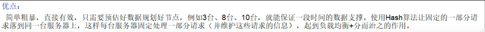
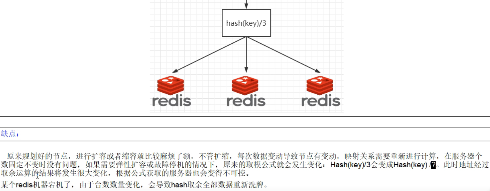
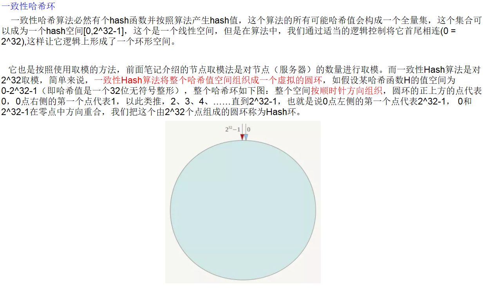
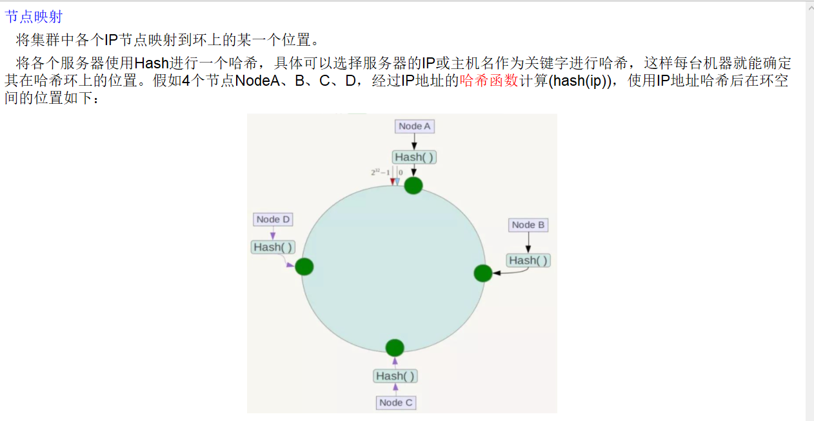
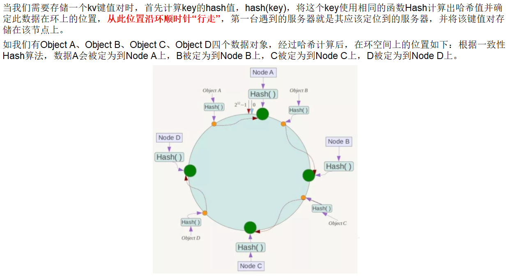
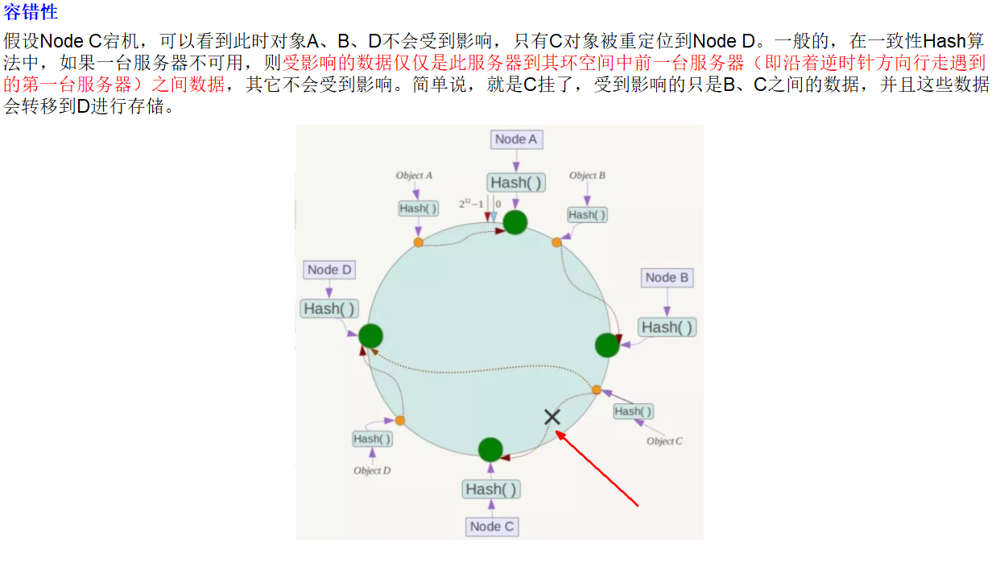
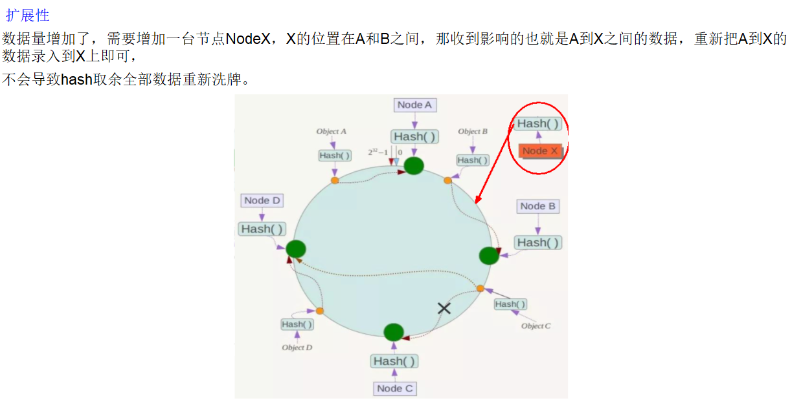
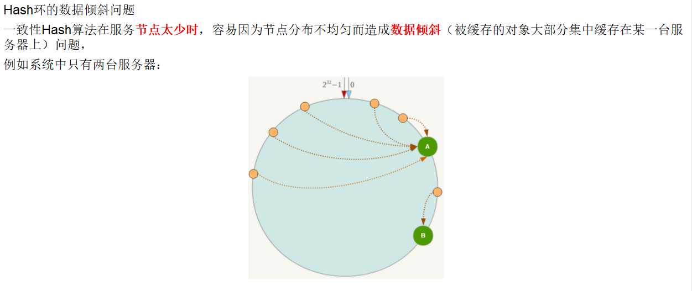
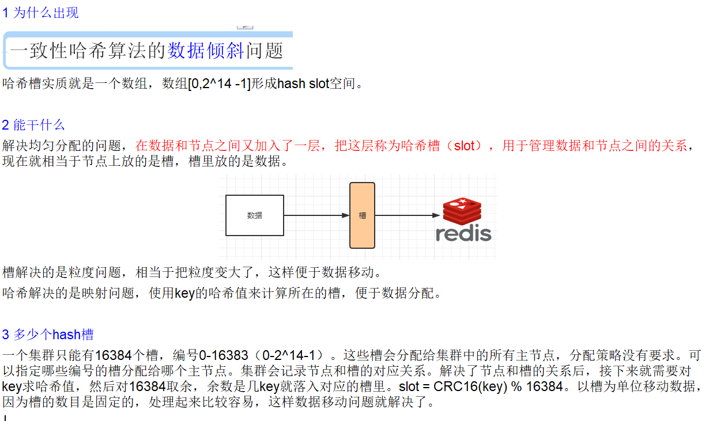
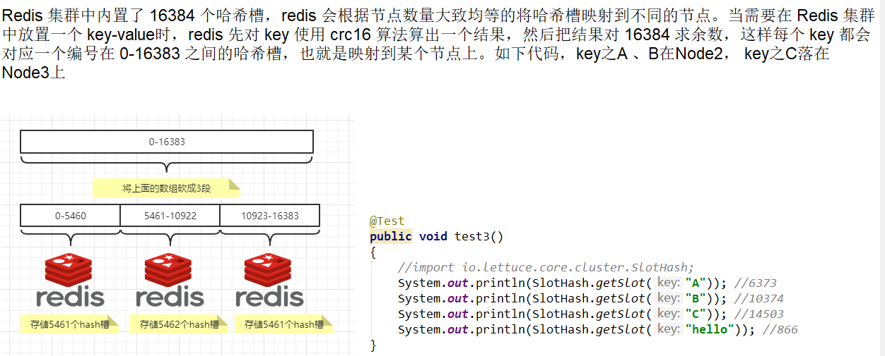

##### 分布式存储之哈希取余算法
Hash(key)%集群数  
  
    
缺点是如果台数变化，会导致hash取余全部数据重新洗牌  
#####  分布式存储之一致性hash算法  
为了解决集群机器数台数变化导致hash函数的分母发生改变而数据全部洗牌，所以有了一致性hash算法  

目的是当服务器个数发送变动时，尽量减少影响客户端到服务端的映射关系  
###### 三大步骤
1.算法构建一致性哈希环  
  
2.服务器IP节点映射  
  
3.服务器IP节点映射  
  
###### 优点  
  
  

###### 缺点
  
###### 一致性hash算法总结  
为了在节点数目发生改变时尽可能少的迁移数据

将所有的存储节点排列在收尾相接的Hash环上，每个key在计算Hash后会顺时针找到临近的存储节点存放。  
而当有节点加入或退出时仅影响该节点在Hash环上顺时针相邻的后续节点。  

优点  
加入和删除节点只影响哈希环中顺时针方向的相邻的节点，对其他节点无影响。  

缺点  
数据的分布和节点的位置有关，因为这些节点不是均匀的分布在哈希环上的，所以数据在进行存储时达不到均匀分布的效果。  


#####第三种算法是大厂常用的算法  
### 分布式存储之哈希槽  
   
```理论来说可以有2^16个槽,编号0·65535，但是redis创始人说，1000个集群就够了，所以只需要2^14```

   
